## Settings from android-12.1.0_r11
### Settings脱离源码在Android Studio的编译
##### 不同安卓版本的支持请切换到对应的分支
### 支持说明
* 不试图改变项目本身的目录结构
* 通过添加额外的配置和依赖构建Gradle环境支持
* 会使用脚本移除一些AS不支持的属性和字段，然后利用git本地忽略
* 修改少量代码，但是总体不影响其作为AOSP的子项目进行mm编译
* 运行的效果会与原生的还是有些许差异，这是由于脱离源码之后，引用private属性失败所导致的样式差异

###  pixel4运行效果：Gradle编译 VS Android.bp编译
---
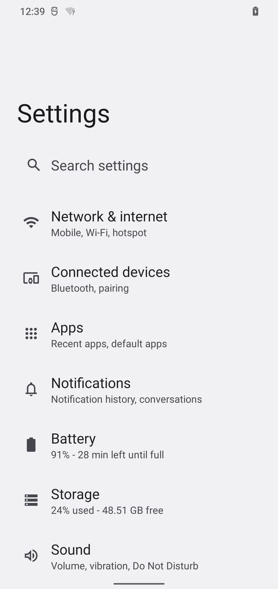 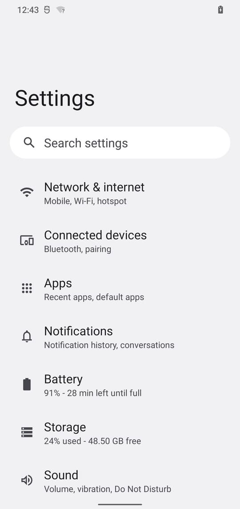

---

## 使用命令编译
### 环境依赖
*  Gradle 7.3.3  
*  JDK version 11

```
# 构建环境
gradle wrapper

# 执行预过滤任务
./gradlew :Filter:run

# 打包编译
 ./gradlew assemble
```


## 在Android Studio上编译
### 推荐使用
*  Android Studio Koala & JDK version 11

### 第一步：运行在Filter上的主函数，执行四个过滤任务
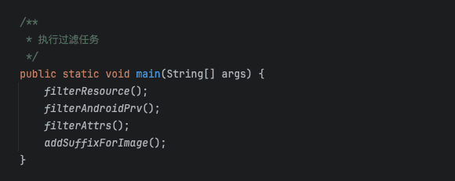

*  移除一些AS不支持的属性和字段，以及减少国际化语言，加快编译速度

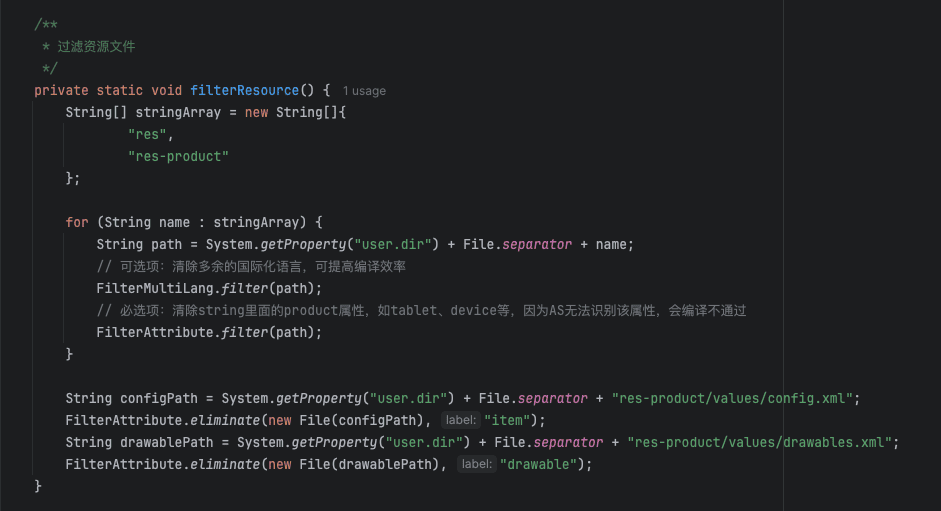

*  对于AS中不支持的androidprv:attr配置的引用值，用一个默认的值去代替

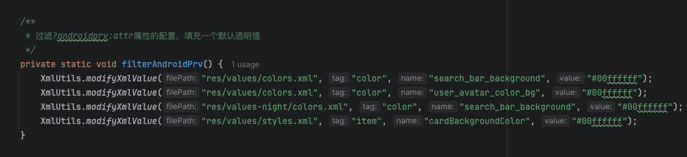

* 有些attr定义的时候被认为是重复的，需要提取出来作为全局的

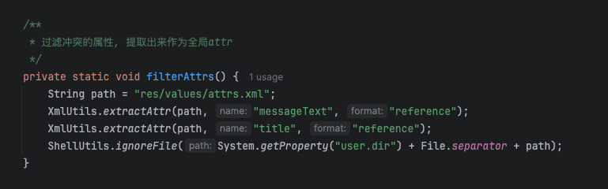

* 给一些图片补上后缀名

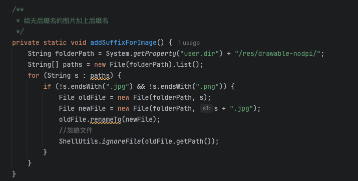

### 第二步：执行Android Studio上Build APK的操作, 然后将apk推送到设备上Settings所在的目录

```
adb push Settings.apk /system/system_ext/priv-app/Settings/

adb shell killall com.android.settings
```
#####  首次推送会起不来，需要重启一下设备
```
adb reboot
```
#####  也支持直接安装

```
adb install Settings.apk

```

## 构建步骤

### Step1：引入静态依赖
##### @framework.jar:
```
// android-12/out/target/common/obj/JAVA_LIBRARIES/framework_intermediates/classes-header.jar
compileOnly files('libs/framework.jar')
```


##### @core-all.jar:
```
// android-12/out/soong/.intermediates/libcore/core-all/android_common/javac/core-all.jar
compileOnly files('libs/core-all.jar')
```
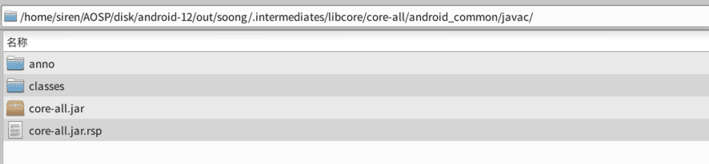

##### @telephony-common.jar:
```
// android-12/out/soong/.intermediates/frameworks/opt/telephony/telephony-common/android_common/javac/telephony-common.jar
compileOnly files('libs/telephony-common.jar')
```
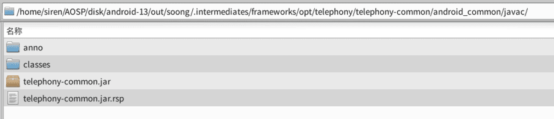


##### @ims-common.jar:
```
// android-12/out/soong/.intermediates/frameworks/opt/net/ims/ims-common/android_common/javac/ims-common.jar
compileOnly files('libs/ims-common.jar')
```
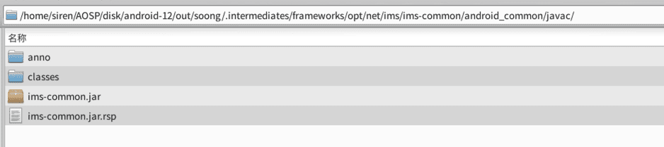

##### @app-compat-annotations.jar:
```
// android-12/out/soong/.intermediates/tools/platform-compat/java/android/compat/annotation/app-compat-annotations/android_common/turbine/app-compat-annotations.jar
compileOnly files('libs/app-compat-annotations.jar')
```
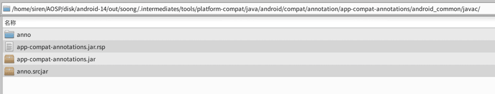


##### @zxing-core-1.7.jar:
```
// android-12/out/soong/.intermediates/external/zxing/core/zxing-core-1.7/android_common/combined/zxing-core-1.7.jar
implementation files('libs/zxing-core-1.7.jar')
```
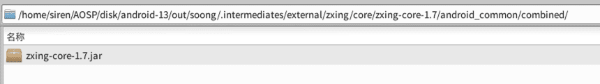


##### @android.hidl.base-V1.0-java.jar:
```
// android-12/out/soong/.intermediates/system/libhidl/transport/base/1.0/android.hidl.base-V1.0-java/android_common/javac/android.hidl.base-V1.0-java.jar
implementation files('libs/android.hidl.base-V1.0-java.jar')
```
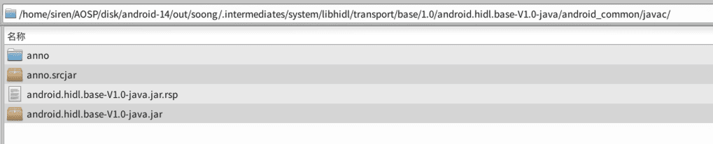


##### @android.hardware.dumpstate-V1.0-java.jar:
```
// android-12/out/soong/.intermediates/hardware/interfaces/dumpstate/1.0/android.hardware.dumpstate-V1.0-java/android_common/javac/android.hardware.dumpstate-V1.0-java.jar
implementation files('libs/android.hardware.dumpstate-V1.0-java.jar')
```
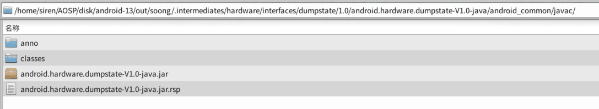


##### @android.hardware.dumpstate-V1.1-java.jar:
```
// android-12/out/soong/.intermediates/hardware/interfaces/dumpstate/1.1/android.hardware.dumpstate-V1.1-java/android_common/javac/android.hardware.dumpstate-V1.1-java.jar
implementation files('libs/android.hardware.dumpstate-V1.1-java.jar')
```
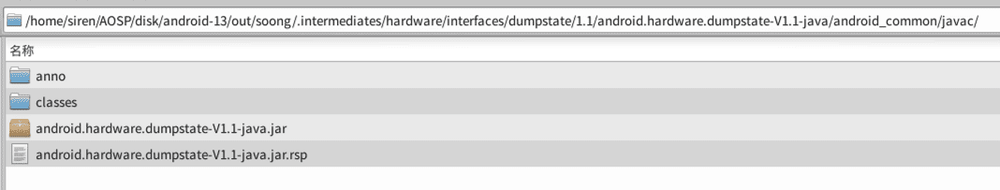


##### @settings-logtags.jar:
```
// android-12/out/soong/.intermediates/packages/apps/Settings/settings-logtags/android_common/javac/settings-logtags.jar
implementation files('libs/settings-logtags.jar')
```
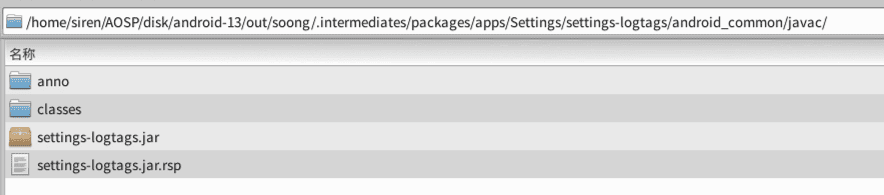


##### @statslog-settings.jar:
```
// android-12/out/soong/.intermediates/packages/apps/Settings/statslog-settings/android_common/javac/statslog-settings.jar
implementation files('libs/statslog-settings.jar')
```
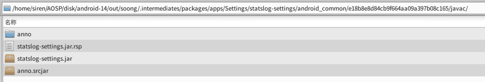

##### @core-icu4j.jar:
```
// android-12/out/soong/.intermediates/external/icu/android_icu4j/core-icu4j/android_common/javac/core-icu4j.jar
implementation files('libs/core-icu4j.jar')
```


##### @preference-1.2.0-alpha01.aar:
```
// android-12/prebuilts/sdk/current/androidx/m2repository/androidx/preference/preference/1.2.0-alpha01/preference-1.2.0-alpha01.aar
implementation(name: 'preference-1.2.0-alpha01', ext: 'aar')
```


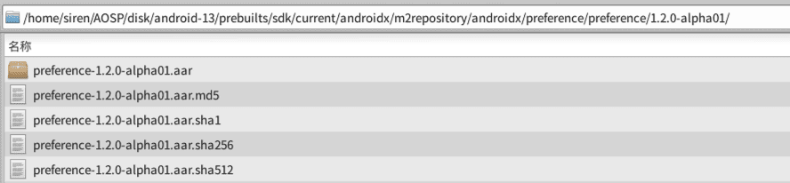
###### ps: androidx.preference 不容易通过以下方式去引用，故换成静态
```
## implementation 'androidx.preference:preference:1.2.0-alpha01'
```

##### @contextualcards.aar:
```
//项目自带aar,不需要从其他地方引入
implementation(name: 'contextualcards', ext: 'aar')
```

##### @window_ext_lib.aar:
```
//项目自带aar
implementation(name: 'window_ext_lib', ext: 'aar')
```


### Step2：引入Module
##### 将具体路径下的代码直接导入到项目中作为Module依赖, 构建的时候可以直接通过implementation project引用，或者也可以gradle build生成aar,再放置到libs文件夹中，作为静态包使用。

##### @iconloaderlib: 
```
// android-12/frameworks/libs/systemui/iconloaderlib
implementation project(':iconloaderlib')
```


##### @WifiTrackerLib: 
```
// android-12/frameworks/opt/net/wifi/libs/WifiTrackerLib
implementation project(':WifiTrackerLib')
```


##### @setupcompat: 
```
// android-12/external/setupcompat
implementation project(':setupcompat')
```


##### @setupdesign: 
```
// android-12/external/setupdesign
implementation project(':setupdesign')
```
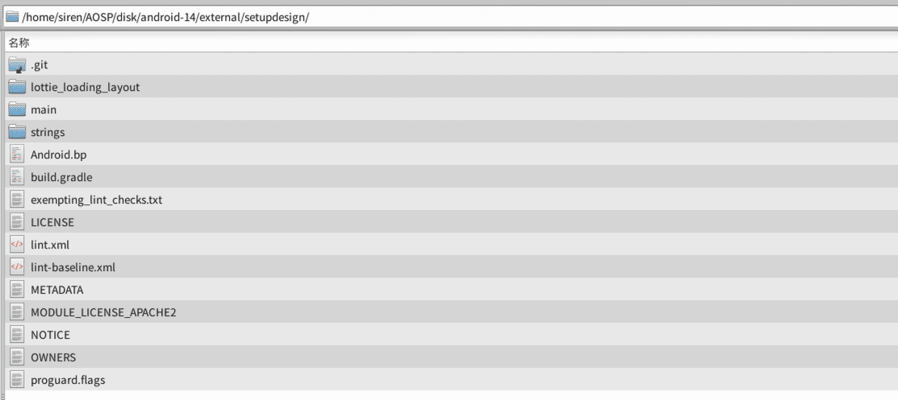


##### @SettingsLib: 
```
// android-12/frameworks/base/packages/SettingsLib
implementation project(':SettingsLib')
implementation project(':SettingsLib:ActionBarShadow')
implementation project(':SettingsLib:RestrictedLockUtils')
implementation project(':SettingsLib:ActionButtonsPreference')
implementation project(':SettingsLib:HelpUtils')
implementation project(':SettingsLib:SettingsSpinner')
implementation project(':SettingsLib:Tile')
implementation project(':SettingsLib:LayoutPreference')
implementation project(':SettingsLib:AppPreference')
implementation project(':SettingsLib:RadioButtonPreference')
implementation project(':SettingsLib:search')
implementation project(':SettingsLib:SearchWidget')
implementation project(':SettingsLib:EntityHeaderWidgets')
implementation project(':SettingsLib:AdaptiveIcon')
implementation project(':SettingsLib:DisplayDensityUtils')
implementation project(':SettingsLib:IllustrationPreference')
implementation project(':SettingsLib:SettingsTransition')
implementation project(':SettingsLib:MainSwitchPreference')
implementation project(':SettingsLib:TwoTargetPreference')
implementation project(':SettingsLib:FooterPreference')
implementation project(':SettingsLib:BannerMessagePreference')
implementation project(':SettingsLib:TopIntroPreference')
implementation project(':SettingsLib:UsageProgressBarPreference')
implementation project(':SettingsLib:CollapsingToolbarBaseActivity')
implementation project(':SettingsLib:EmergencyNumber')
```
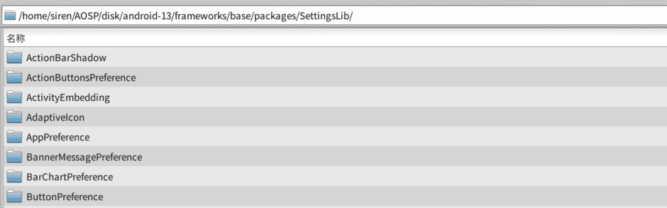


## 生成platform.keystore默认签名

在android-12/build/target/product/security路径下找到签名证书，并使用 [keytool-importkeypair](https://github.com/getfatday/keytool-importkeypair) 生成keystore,
执行如下命令：  

```
./keytool-importkeypair -k platform.keystore -p 123456 -pk8 platform.pk8 -cert platform.x509.pem -alias platform
```

并将以下代码添加到gradle配置中：

```
    signingConfigs {
        platform {
            storeFile file("platform.keystore")
            storePassword '123456'
            keyAlias 'platform'
            keyPassword '123456'
        }
    }

    buildTypes {
        release {
            debuggable false
            minifyEnabled false
            signingConfig signingConfigs.platform
        }

        debug {
            debuggable true
            minifyEnabled false
            signingConfig signingConfigs.platform
        }
    }
```

### PS:
##### 查看被忽略的文件列表
```
git ls-files -v | grep '^h\ '
```  

##### 忽略和还原单个文件
``` 
git update-index --assume-unchanged $path
git update-index --no-assume-unchanged $path
``` 

##### 还原全部被忽略的文件
```
git ls-files -v | grep '^h' | awk '{print $2}' |xargs git update-index --no-assume-unchanged 
```

---

### 关联项目
* [SystemUI](https://github.com/siren-ocean/SystemUI)
* [Launcher3](https://github.com/siren-ocean/Launcher3)
* [DocumentsUI](https://github.com/siren-ocean/DocumentsUI)
* [Camera2](https://github.com/siren-ocean/Camera2)
* [PermissionController](https://github.com/siren-ocean/PermissionController)