## Settings from android-14.0.0_r67
### Settings脱离源码在Android Studio的编译
##### 不同安卓版本的支持请切换到对应的分支
### 支持说明
* 不试图改变项目本身的目录结构
* 通过添加额外的配置和依赖构建Gradle环境支持
* 会使用脚本移除一些AS不支持的属性和字段，以及java代码中的少部分资源引用，然后利用git本地忽略
* 修改少量代码，但是总体不影响其作为AOSP的子项目进行mm编译
* 运行的效果会与原生的有些许差异，其中一个原因是脱离源码之后，引用private属性失败所导致的样式差异，另一个原因是androidprv的属性无法被AS正常识别，会被我们用脚本进行暂时性的替代。

###  pixel7运行效果：Gradle编译 VS Android.bp编译
---
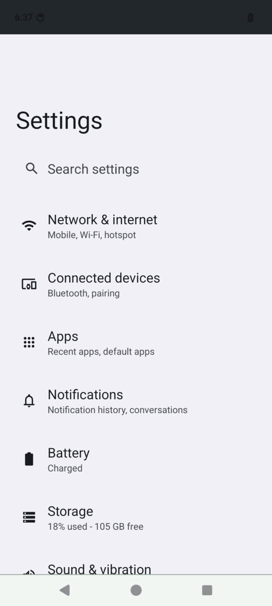 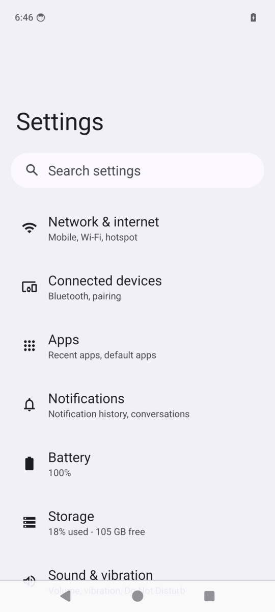

---

## 使用命令编译
### 环境依赖
*  Gradle 8.5
*  JDK version 17

```
# 构建环境
gradle wrapper

# 执行预过滤任务
./gradlew :Filter:run

# 打包编译
 ./gradlew assemble
```


## 在Android Studio上编译
### 推荐使用
*  Android Studio Koala & JDK version 17

### 第一步：运行在Filter上的主函数，执行三个过滤任务


*  移除一些AS不支持的属性和字段，以及减少国际化语言，加快编译速度


*  对于AS中不支持的androidprv:attr配置的引用值，用一个默认的值去代替


* 暴力过滤，解决一些资源属性引用失败问题

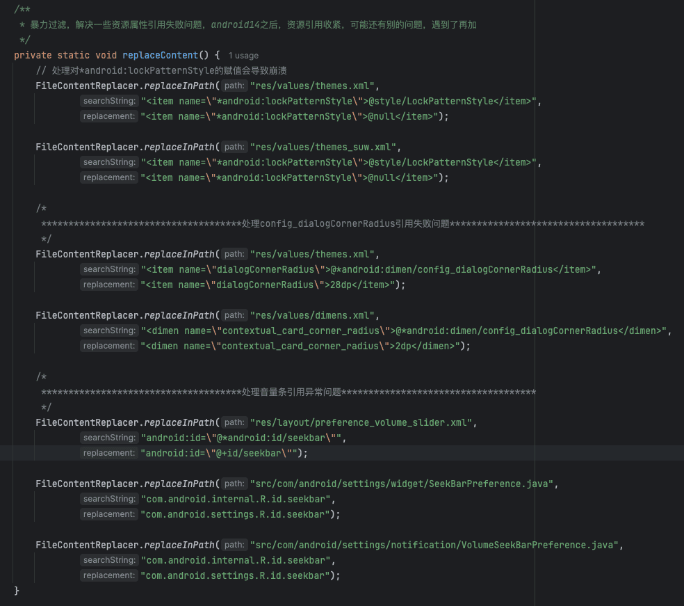


### 第二步：执行Android Studio上Build APK的操作, 然后将apk推送到设备上Settings所在的目录

```
adb push Settings.apk /system/system_ext/priv-app/Settings/

adb shell killall com.android.settings
```
#####  首次推送会起不来，需要重启一下设备
```
adb reboot
```
#####  也支持直接安装

```
adb install Settings.apk

```

## 构建步骤

### Step1：引入静态依赖
##### @framework.jar:
```
// android-14/out/target/common/obj/JAVA_LIBRARIES/framework_intermediates/classes-header.jar
compileOnly files('libs/framework.jar')
```


##### @core-all.jar:
```
// android-14/out/soong/.intermediates/libcore/core-all/android_common/javac/core-all.jar
compileOnly files('libs/core-all.jar')
```


##### @telephony-common.jar:
```
// android-14/out/soong/.intermediates/frameworks/opt/telephony/telephony-common/android_common/e18b8e8d84cb9f664aa09a397b08c165/javac/telephony-common.jar
compileOnly files('libs/telephony-common.jar')
```


##### @ims-common.jar:
```
// android-14/out/soong/.intermediates/frameworks/opt/net/ims/ims-common/android_common/e18b8e8d84cb9f664aa09a397b08c165/javac/ims-common.jar
compileOnly files('libs/ims-common.jar')
```


##### @app-compat-annotations.jar:
```
// android-14/out/soong/.intermediates/tools/platform-compat/java/android/compat/annotation/app-compat-annotations/android_common/javac/app-compat-annotations.jar
compileOnly files('libs/app-compat-annotations.jar')
```


##### @zxing-core.jar:
```
// android-14/out/soong/.intermediates/external/zxing/zxing-core/android_common/e18b8e8d84cb9f664aa09a397b08c165/javac/zxing-core.jar
implementation files('libs/zxing-core.jar')
```


##### @android.hardware.dumpstate-V1-java.jar:
```
// android-14/out/soong/.intermediates/hardware/interfaces/dumpstate/aidl/android.hardware.dumpstate-V1-java/android_common/javac/android.hardware.dumpstate-V1-java.jar
implementation files('libs/android.hardware.dumpstate-V1-java.jar')
```
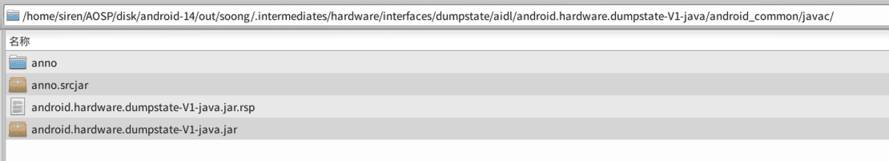


##### @android.hardware.dumpstate-V1.0-java.jar:
```
// android-14/out/soong/.intermediates/hardware/interfaces/dumpstate/1.0/android.hardware.dumpstate-V1.0-java/android_common/javac/android.hardware.dumpstate-V1.0-java.jar
implementation files('libs/android.hardware.dumpstate-V1.0-java.jar')
```


##### @android.hardware.dumpstate-V1.1-java.jar:
```
// android-14/out/soong/.intermediates/hardware/interfaces/dumpstate/1.1/android.hardware.dumpstate-V1.1-java/android_common/javac/android.hardware.dumpstate-V1.1-java.jar
implementation files('libs/android.hardware.dumpstate-V1.1-java.jar')
```


##### @android.hidl.base-V1.0-java.jar:
```
// android-14/out/soong/.intermediates/system/libhidl/transport/base/1.0/android.hidl.base-V1.0-java/android_common/javac/android.hidl.base-V1.0-java.jar
implementation files('libs/android.hidl.base-V1.0-java.jar')
```


##### @android.view.accessibility.flags-aconfig-java.jar:
```
// android-14/out/soong/.intermediates/frameworks/base/android.view.accessibility.flags-aconfig-java/android_common/javac/android.view.accessibility.flags-aconfig-java.jar
implementation files('libs/android.view.accessibility.flags-aconfig-java.jar')
```
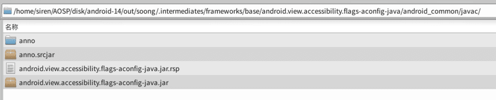


##### @com_android_server_accessibility_flags_lib.jar:
```
// android-14/out/soong/.intermediates/frameworks/base/services/accessibility/com_android_server_accessibility_flags_lib/android_common/e18b8e8d84cb9f664aa09a397b08c165/javac/com_android_server_accessibility_flags_lib.jar
implementation files('libs/com_android_server_accessibility_flags_lib.jar')
```
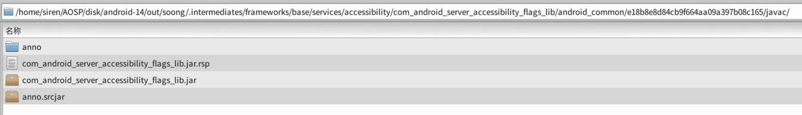

##### @net-utils-framework-common.jar:
```
// android-14/out/soong/.intermediates/packages/modules/Connectivity/staticlibs/net-utils-framework-common/android_common/javac/net-utils-framework-common.jar
implementation files('libs/net-utils-framework-common.jar')
```
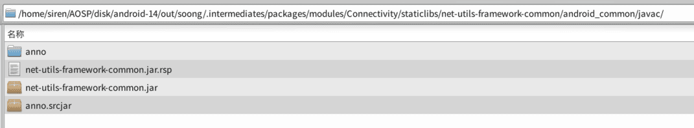


##### @notification_flags_lib.jar:
```
// android-14/out/soong/.intermediates/packages/modules/Connectivity/staticlibs/net-utils-framework-common/android_common/javac/notification_flags_lib.jar
implementation files('libs/notification_flags_lib.jar')
```


##### @securebox.jar:
```
// android-14/out/soong/.intermediates/frameworks/base/libs/securebox/securebox/android_common/e18b8e8d84cb9f664aa09a397b08c165/javac/securebox.jar
implementation files('libs/securebox.jar')
```
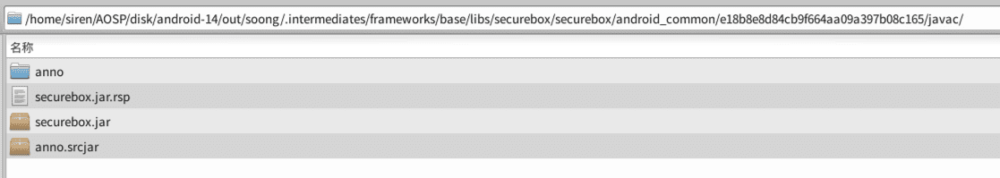


##### @MediaDrmSettingsFlagsLib.jar:
```
// android-14/out/soong/.intermediates/packages/apps/Settings/aconfig/MediaDrmSettingsFlagsLib/android_common/e18b8e8d84cb9f664aa09a397b08c165/javac/MediaDrmSettingsFlagsLib.jar
implementation files('libs/MediaDrmSettingsFlagsLib.jar')
```
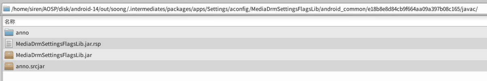


##### @aconfig_settings_flags_lib.jar:
```
// android-14/out/soong/.intermediates/packages/apps/Settings/aconfig/aconfig_settings_flags_lib/android_common/e18b8e8d84cb9f664aa09a397b08c165/javac/aconfig_settings_flags_lib.jar
implementation files('libs/aconfig_settings_flags_lib.jar')
```
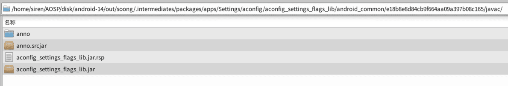


##### @accessibility_settings_flags_lib.jar:
```
// android-14/out/soong/.intermediates/packages/apps/Settings/aconfig/accessibility_settings_flags_lib/android_common/e18b8e8d84cb9f664aa09a397b08c165/javac/accessibility_settings_flags_lib.jar
implementation files('libs/accessibility_settings_flags_lib.jar')
```
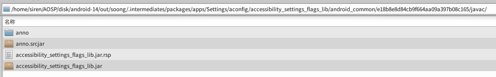


##### @app-usage-event-protos-lite.jar:
```
// android-14/out/soong/.intermediates/packages/apps/Settings/src/com/android/settings/fuelgauge/protos/app-usage-event-protos-lite/android_common/e18b8e8d84cb9f664aa09a397b08c165/javac/app-usage-event-protos-lite.jar
implementation files('libs/app-usage-event-protos-lite.jar')
```
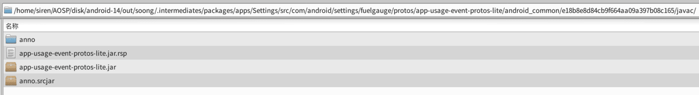


##### @battery-event-protos-lite.jar:
```
// android-14/out/soong/.intermediates/packages/apps/Settings/src/com/android/settings/fuelgauge/protos/battery-event-protos-lite/android_common/e18b8e8d84cb9f664aa09a397b08c165/javac/battery-event-protos-lite.jar
implementation files('libs/battery-event-protos-lite.jar')
```


##### @battery-usage-slot-protos-lite.jar:
```
// android-14/out/soong/.intermediates/packages/apps/Settings/src/com/android/settings/fuelgauge/protos/battery-usage-slot-protos-lite/android_common/e18b8e8d84cb9f664aa09a397b08c165/javac/battery-usage-slot-protos-lite.jar
implementation files('libs/battery-usage-slot-protos-lite.jar')
```
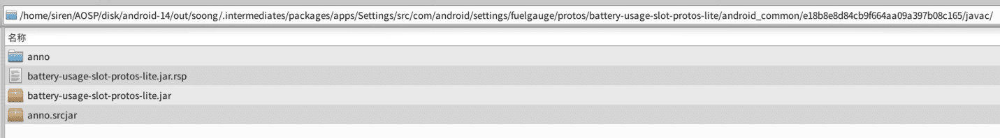

##### @factory_reset_flags_lib.jar:
```
// android-14/out/soong/.intermediates/packages/apps/Settings/aconfig/factory_reset_flags_lib/android_common/e18b8e8d84cb9f664aa09a397b08c165/javac/factory_reset_flags_lib.jar
implementation files('libs/factory_reset_flags_lib.jar')
```
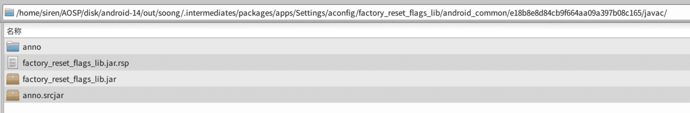

##### @fuelgauge-log-protos-lite.jar:
```
// android-14/out/soong/.intermediates/packages/apps/Settings/protos/fuelgauge-log-protos-lite/android_common/e18b8e8d84cb9f664aa09a397b08c165/javac/fuelgauge-log-protos-lite.jar
implementation files('libs/fuelgauge-log-protos-lite.jar')
```
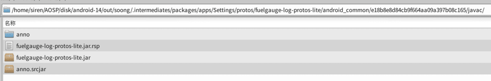

##### @fuelgauge-usage-state-protos-lite.jar:
```
// android-14/out/soong/.intermediates/packages/apps/Settings/src/com/android/settings/fuelgauge/protos/fuelgauge-usage-state-protos-lite/android_common/e18b8e8d84cb9f664aa09a397b08c165/javac/fuelgauge-usage-state-protos-lite.jar
implementation files('libs/fuelgauge-usage-state-protos-lite.jar')
```
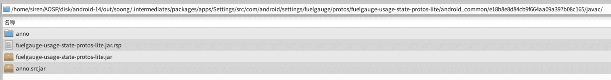


##### @power-anomaly-event-protos-lite.jar:
```
// android-14/out/soong/.intermediates/packages/apps/Settings/src/com/android/settings/fuelgauge/protos/power-anomaly-event-protos-lite/android_common/e18b8e8d84cb9f664aa09a397b08c165/javac/power-anomaly-event-protos-lite.jar
implementation files('libs/power-anomaly-event-protos-lite.jar')
```
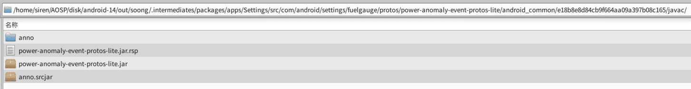


##### @settings-contextual-card-protos-lite.jar:
```
// android-14/out/soong/.intermediates/packages/apps/Settings/protos/settings-contextual-card-protos-lite/android_common/e18b8e8d84cb9f664aa09a397b08c165/javac/settings-contextual-card-protos-lite.jar
implementation files('libs/settings-contextual-card-protos-lite.jar')
```
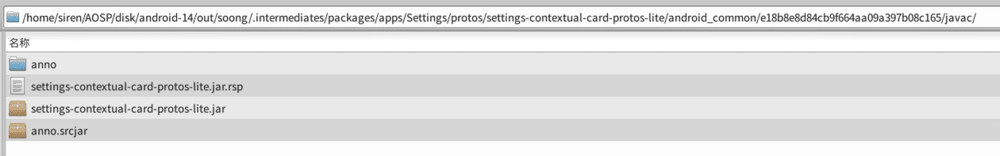

##### @settings-log-bridge-protos-lite.jar:
```
// android-14/out/soong/.intermediates/packages/apps/Settings/protos/settings-log-bridge-protos-lite/android_common/e18b8e8d84cb9f664aa09a397b08c165/javac/settings-log-bridge-protos-lite.jar
implementation files('libs/settings-log-bridge-protos-lite.jar')
```
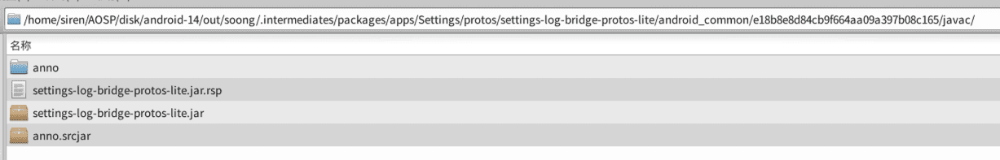

##### @settings-logtags.jar:
```
// android-14/out/soong/.intermediates/packages/apps/Settings/settings-logtags/android_common/e18b8e8d84cb9f664aa09a397b08c165/javac/settings-logtags.jar
implementation files('libs/settings-logtags.jar')
```


##### @settingslib_media_flags_lib.jar:
```
// android-14/out/soong/.intermediates/frameworks/base/packages/SettingsLib/settingslib_media_flags_lib/android_common/e18b8e8d84cb9f664aa09a397b08c165/javac/settingslib_media_flags_lib.jar
implementation files('libs/settingslib_media_flags_lib.jar')
```
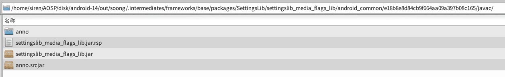


##### @settings-telephony-protos-lite.jar:
```
// android-14/out/soong/.intermediates/packages/apps/Settings/protos/settings-telephony-protos-lite/android_common/e18b8e8d84cb9f664aa09a397b08c165/javac/settings-telephony-protos-lite.jar
implementation files('libs/settings-telephony-protos-lite.jar')
```
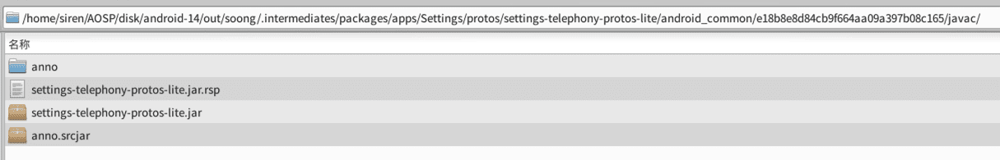


##### @statslog-settings.jar:
```
// android-14/out/soong/.intermediates/packages/apps/Settings/statslog-settings/android_common/e18b8e8d84cb9f664aa09a397b08c165/javac/statslog-settings.jar
implementation files('libs/statslog-settings.jar')
```


##### @telecom_flags_core_java_lib.jar:
```
// android-14/out/soong/.intermediates/frameworks/base/telecom_flags_core_java_lib/android_common/javac/telecom_flags_core_java_lib.jar
implementation files('libs/telecom_flags_core_java_lib.jar')
```
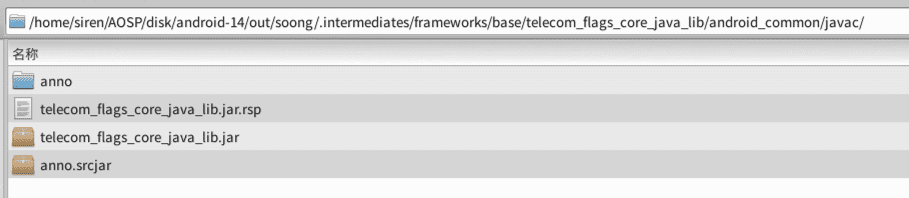


##### @settingslib_flags_lib.jar:
```
// android-14/out/soong/.intermediates/frameworks/base/packages/SettingsLib/settingslib_flags_lib/android_common/e18b8e8d84cb9f664aa09a397b08c165/javac/settingslib_flags_lib.jar
implementation files('libs/settingslib_flags_lib.jar')
```
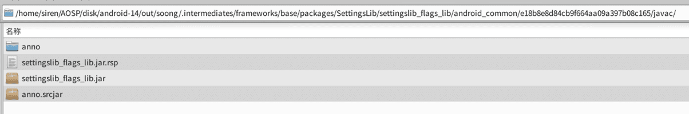


##### @development_settings_flag_lib.jar:
```
// android-14/out/soong/.intermediates/packages/apps/Settings/aconfig/development_settings_flag_lib/android_common/e18b8e8d84cb9f664aa09a397b08c165/javac/development_settings_flag_lib.jar
implementation files('libs/development_settings_flag_lib.jar')
```
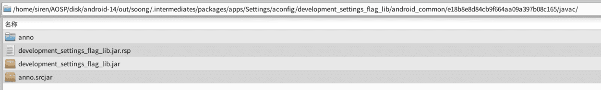


##### @core-icu4j.jar:
```
// android-14/out/soong/.intermediates/external/icu/android_icu4j/core-icu4j/android_common/javac/core-icu4j.jar
implementation files('libs/core-icu4j.jar')
```


##### @wifi_aconfig_flags_lib.jar:
```
// android-14/out/soong/.intermediates/packages/modules/Wifi/flags/wifi_aconfig_flags_lib/android_common/e18b8e8d84cb9f664aa09a397b08c165/javac/wifi_aconfig_flags_lib.jar
implementation files('libs/wifi_aconfig_flags_lib.jar')
```
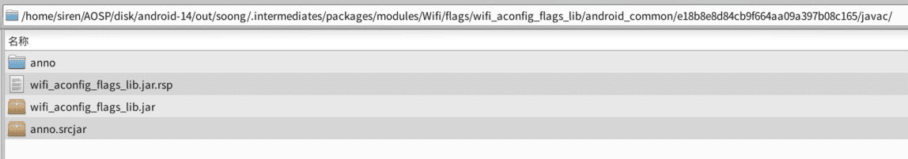


##### @preference-1.3.0-alpha01.aar:
```
// android-14/prebuilts/sdk/current/androidx/m2repository/androidx/preference/preference/1.3.0-alpha01/preference-1.3.0-alpha01.aar
implementation(':preference-1.3.0-alpha01@aar')
```

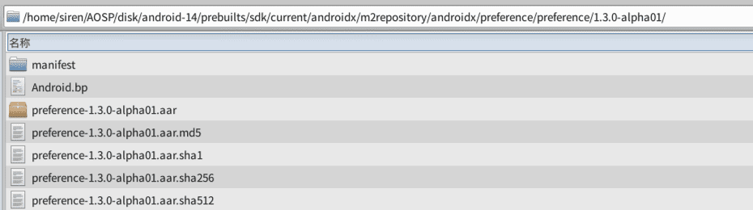
###### ps: androidx.preference 不容易通过以下方式去引用，故换成静态
```
## implementation 'androidx.preference:preference:1.2.0-alpha01'
```

##### @contextualcards.aar:
```
//项目自带aar,不需要从其他地方引入
implementation(':contextualcards@aar')
```


### Step2：引入Module
##### 将具体路径下的代码直接导入到项目中作为Module依赖, 构建的时候可以直接通过implementation project引用，或者也可以gradle build生成aar,再放置到libs文件夹中，作为静态包使用。

##### @iconloaderlib: 
```
// android-14/frameworks/libs/systemui/iconloaderlib
implementation project(':iconloaderlib')
```


##### @WifiTrackerLib: 
```
// android-14/frameworks/opt/net/wifi/libs/WifiTrackerLib
implementation project(':WifiTrackerLib')
```


##### @setupcompat: 
```
// android-14/external/setupcompat
implementation project(':setupcompat')
```


##### @setupdesign: 
```
// android-14/external/setupdesign
implementation project(':setupdesign')
```


##### @biometrics: 
```
// android-14/frameworks/base/packages/SystemUI/shared/biometrics
implementation project(':biometrics')
```
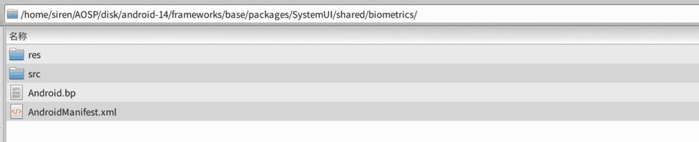

##### @unfold: 
```
// android-14/frameworks/base/packages/SystemUI/unfold
implementation project(':unfold')
```
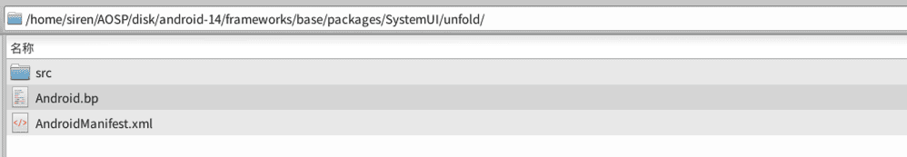


##### @SettingsLib: 
```
// android-14/frameworks/base/packages/SettingsLib
include ':SettingsLib'
include 'SettingsLib:Tile'
include 'SettingsLib:AdaptiveIcon'
include 'SettingsLib:RestrictedLockUtils'
include 'SettingsLib:HelpUtils'
include 'SettingsLib:SettingsTheme'
include 'SettingsLib:AppPreference'
include 'SettingsLib:SearchWidget'
include 'SettingsLib:SettingsSpinner'
include 'SettingsLib:LayoutPreference'
include 'SettingsLib:ActionButtonsPreference'
include 'SettingsLib:EntityHeaderWidgets'
include 'SettingsLib:BarChartPreference'
include 'SettingsLib:ProgressBar'
include 'SettingsLib:Utils'
include 'SettingsLib:ActionBarShadow'
include 'SettingsLib:search'
include 'SettingsLib:ActivityEmbedding'
include 'SettingsLib:BannerMessagePreference'
include 'SettingsLib:SettingsTransition'
include 'SettingsLib:CollapsingToolbarBaseActivity'
include 'SettingsLib:EmergencyNumber'
include 'SettingsLib:FooterPreference'
include 'SettingsLib:IllustrationPreference'
include 'SettingsLib:UsageProgressBarPreference'
include 'SettingsLib:TwoTargetPreference'
include 'SettingsLib:TopIntroPreference'
include 'SettingsLib:MainSwitchPreference'
include 'SettingsLib:ButtonPreference'
include 'SettingsLib:SelectorWithWidgetPreference'
include 'SettingsLib:Color'
include 'SettingsLib:DataStore'
include 'SettingsLib:DeviceStateRotationLock'
include 'SettingsLib:DisplayUtils'
include 'SettingsLib:ProfileSelector'

include ':spa'
project(':spa').projectDir = new File('SettingsLib/Spa/spa')

include ':SpaPrivileged'
project(':SpaPrivileged').projectDir = new File('SettingsLib/SpaPrivileged')
```


## 生成platform.keystore默认签名

在android-14/build/target/product/security路径下找到签名证书，并使用 [keytool-importkeypair](https://github.com/getfatday/keytool-importkeypair) 生成keystore,
执行如下命令：  

```
./keytool-importkeypair -k platform.keystore -p 123456 -pk8 platform.pk8 -cert platform.x509.pem -alias platform
```

并将以下代码添加到gradle配置中：

```
    signingConfigs {
        platform {
            storeFile file("platform.keystore")
            storePassword '123456'
            keyAlias 'platform'
            keyPassword '123456'
        }
    }

    buildTypes {
        release {
            debuggable false
            minifyEnabled false
            signingConfig signingConfigs.platform
        }

        debug {
            debuggable true
            minifyEnabled false
            signingConfig signingConfigs.platform
        }
    }
```

### PS:
##### 查看被忽略的文件列表
```
git ls-files -v | grep '^h\ '
```  

##### 忽略和还原单个文件
``` 
git update-index --assume-unchanged $path
git update-index --no-assume-unchanged $path
``` 

##### 还原全部被忽略的文件
```
git ls-files -v | grep '^h' | awk '{print $2}' |xargs git update-index --no-assume-unchanged 
```

---

### 关联项目
* [SystemUI](https://github.com/siren-ocean/SystemUI)
* [Launcher3](https://github.com/siren-ocean/Launcher3)
* [DocumentsUI](https://github.com/siren-ocean/DocumentsUI)
* [Camera2](https://github.com/siren-ocean/Camera2)
* [PermissionController](https://github.com/siren-ocean/PermissionController)